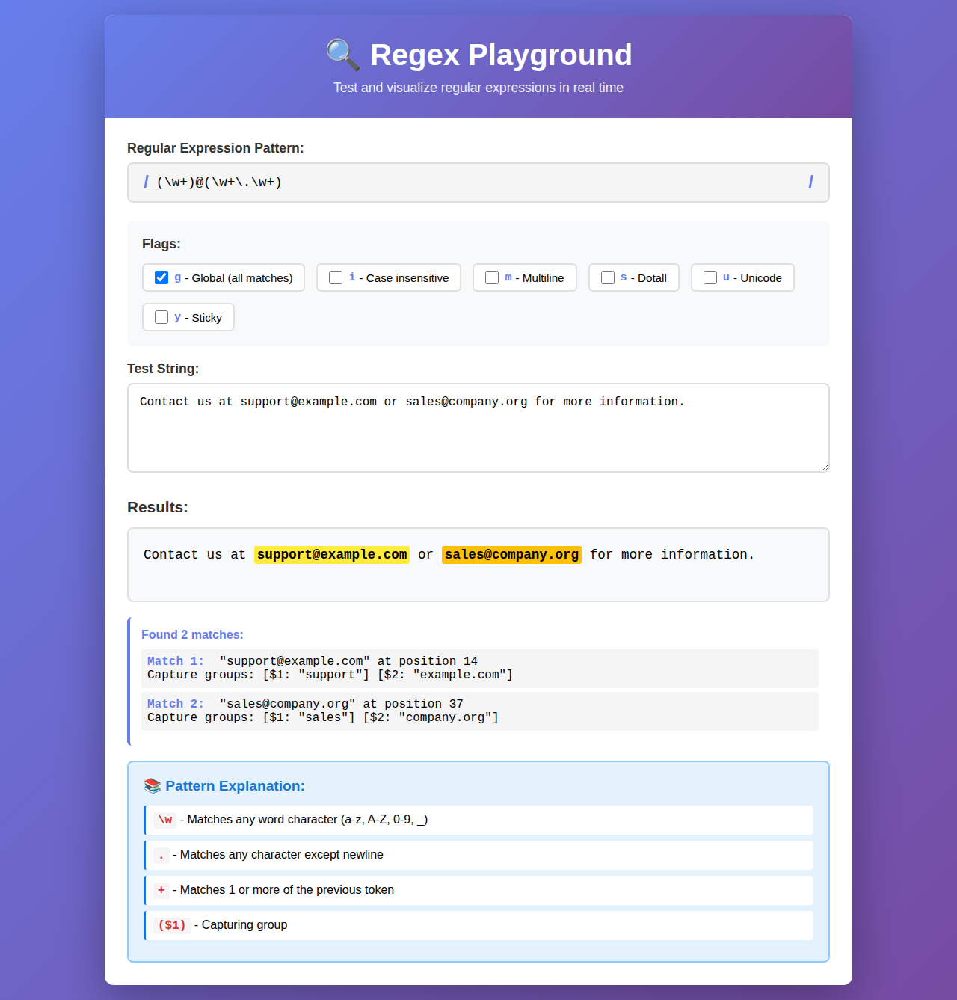
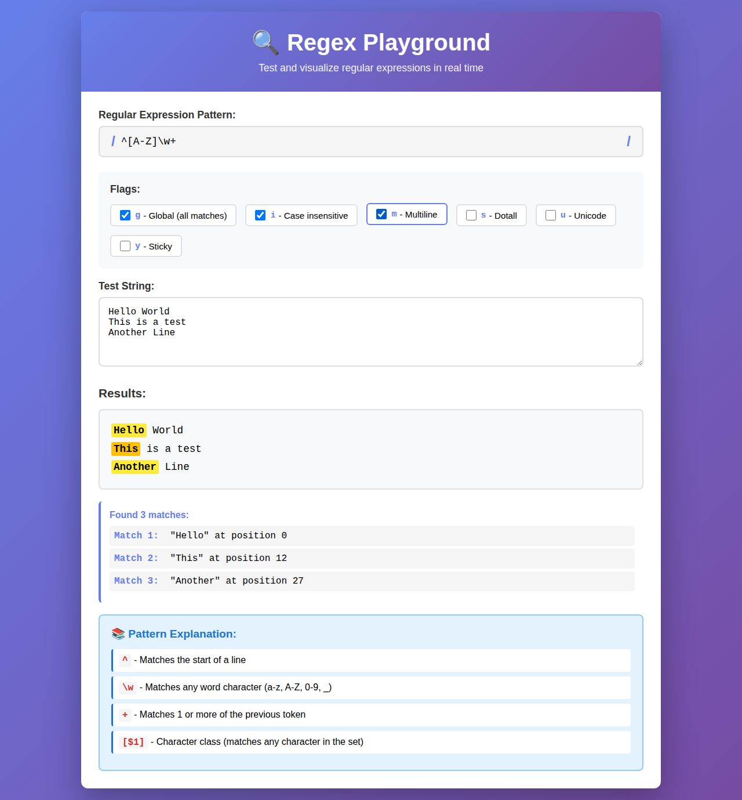
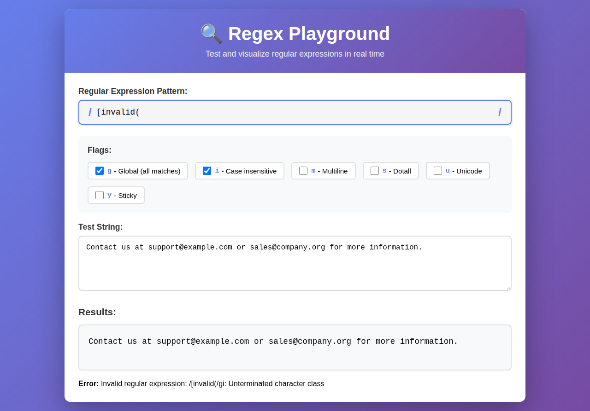

# Regex Playground

🔍 Test and visualize regular expressions in real time with this interactive, client-side web application.

## Features

- **Live Pattern Testing** - See regex matches update in real-time as you type
- **Visual Match Highlighting** - Matches are highlighted with alternating colors for easy identification
- **Regex Flags Support** - Toggle all 6 JavaScript regex flags (g, i, m, s, u, y)
- **Pattern Explanations** - Automatic detection and explanation of regex components
- **Capture Groups Display** - View captured groups for each match
- **Error Handling** - Clear error messages for invalid regex patterns
- **100% Client-Side** - No server required, works completely offline
- **Responsive Design** - Works seamlessly on desktop and mobile devices

## Usage

Simply open `index.html` in your web browser. No build process or dependencies required!

### Quick Start

1. Enter a regex pattern in the pattern field (e.g., `\d+`, `[A-Z]\w+`, `(\w+)@(\w+\.\w+)`)
2. Toggle any flags you need (global, case-insensitive, multiline, etc.)
3. Enter or paste text to test in the test string field
4. See matches highlighted instantly with detailed information

### Examples

**Match email addresses:**
- Pattern: `(\w+)@(\w+\.\w+)`
- Flags: `g` (global)
- Shows captured username and domain parts

**Match words starting with capital letters:**
- Pattern: `^[A-Z]\w+`
- Flags: `g` (global), `m` (multiline)
- Matches words at the start of each line

**Match digits:**
- Pattern: `\d+`
- Flags: `g` (global)
- Finds all sequences of digits

## Regex Flags

- **g** - Global: Find all matches instead of stopping after first match
- **i** - Case insensitive: Match both uppercase and lowercase letters
- **m** - Multiline: `^` and `$` match line starts/ends instead of string starts/ends
- **s** - Dotall: `.` matches newline characters
- **u** - Unicode: Enable full unicode support
- **y** - Sticky: Match only from the index indicated by lastIndex property

## Pattern Explanations

The playground automatically explains common regex patterns:
- Character classes (`\d`, `\w`, `\s`, etc.)
- Anchors (`^`, `$`, `\b`)
- Quantifiers (`+`, `*`, `?`, `{n,m}`)
- Groups and alternation (`()`, `|`)
- And more!

## Security

All user input is properly escaped before being displayed, preventing XSS attacks. The application runs entirely in your browser with no external API calls or data transmission.

## Browser Compatibility

Works in all modern browsers that support:
- ES6 JavaScript
- CSS Grid and Flexbox
- HTML5

Tested on:
- Chrome/Edge (latest)
- Firefox (latest)
- Safari (latest)

## Development

This is a single-file HTML application with embedded CSS and JavaScript. To modify:

1. Edit `index.html`
2. Open in browser to test
3. No build process needed!

## License

See LICENSE file for details.

## Contributing

Contributions are welcome! Please feel free to submit issues or pull requests.
